# Makeup Courses App

A Flutter application for a subscription-based makeup course platform — browse courses, watch lessons, track progress, and manage a subscription. Built with Clean Architecture, Bloc/Cubit state management, and a Supabase backend.

> **Project status:** Development was discontinued after the client cancelled the engagement partway through implementation. This repository reflects a partially completed application. See [Project Status](#-project-status) for a precise breakdown of what was finished.

## 📱 Overview

Makeup Courses App was built for a client who wanted a mobile platform for selling and delivering a catalog of makeup courses to end users. The intended product: browse and search courses, watch video lessons, track lesson/course progress, and subscribe for access — in both English and Arabic.

The project was cancelled by the client before the payment and video-delivery integrations were finalized, so those areas remain on a provider chosen during early development (RevenueCat for subscriptions, Vimeo for video) rather than a production-ready, self-hosted solution. Core product surfaces — auth, course browsing, course details, lesson playback, progress tracking, and profile management — are implemented against a real Supabase backend.

## ✨ Features

### Implemented

- **Authentication** — email/password sign-up & sign-in, Google Sign-In, Sign in with Apple, forgot/reset password, OTP-based password recovery, deep-link recovery handling (`makeupapp://callback`)
- **Onboarding flow** with a one-time "seen" flag persisted locally
- **Course browsing** — category filters, search, sponsored courses banner, paginated course grid
- **Course details** — hero section, description, lesson list, ratings/review summary
- **Reviews** — course review list, rating distribution, write-a-review section
- **Lesson player** — Vimeo-embedded video playback via WebView, lesson lock/unlock based on subscription state, mark-lesson-complete, sibling lesson navigation
- **Lesson & course progress tracking** — per-lesson status (`in_progress` / `completed`) persisted via Supabase RPC, aggregated into course-level watch history/progress
- **"My Learning"** — continue-watching list and per-course progress, backed by a `get_watch_history` Supabase RPC (replacing an earlier Favorites feature, in progress in the current branch)
- **Subscription/payment screens** — Go Premium paywall, plan selection, manage-subscription screen (see [Payments & Subscriptions](#-payments--subscriptions) for implementation status)
- **Profile & settings** — profile view/edit, avatar upload to Supabase Storage, language toggle (EN/AR), notification toggle UI, delete-account flow
- **Static content pages** — About Instructor, Privacy Policy, Terms of Service, sourced from Supabase
- **Full localization** — English and Arabic, 273 matching keys in both `.arb` files, with automatic RTL layout for Arabic
- **Light/dark theme** support via a Figma-derived color system
- **Connectivity handling** — no-internet UI state and router-level offline redirect guard

### In Progress / Partially Implemented

- **My Learning / Favorites migration** — the former Favorites tab/feature is being replaced by a "My Learning" (continue watching + progress) tab; this was mid-refactor (uncommitted changes) when development stopped
- **Subscription purchase flow** — UI and domain/repository layers are complete, but wired to a **dummy data source** (`PaymentRemoteDataSourceDummy`) that returns hardcoded offerings/customer info; no live RevenueCat project is connected
- **Notifications** — a toggle exists in Profile settings, but no push-notification delivery is implemented

### Planned

These were part of the original scope but not reached before cancellation:

- Live payment integration (a live RevenueCat project, or a migration to a different payment processor)
- Production video hosting/DRM strategy (the current implementation depends on Vimeo's hosted player)
- Admin/content-management tooling (all content in the current app is authored directly in Supabase tables; there is no in-app admin surface)
- Automated test coverage beyond the single smoke test currently in the repo
- Push notifications

## 🏗️ Architecture

The app follows **Clean Architecture** with a clear separation between layers, applied per-feature under `lib/features/`:

- **Presentation** — Pages, widgets, and Cubits (`flutter_bloc`) holding `freezed` immutable state
- **Domain** — Entities and repository interfaces, independent of any data source
- **Data** — Repository implementations, remote data sources (Supabase), and DTO models (`freezed` + `json_serializable`)

Other architectural building blocks:

- **Repository pattern** — every feature exposes a domain repository interface with a Supabase-backed implementation (some features also ship a `*RepositoryDummy`/`*DataSourceDummy` used for UI development without a live backend)
- **Dependency injection** — `get_it` + `injectable`, with code generation (`providers.config.dart`)
- **Routing** — `go_router`, using a `StatefulShellRoute` for the bottom-nav tabs (Home / My Learning / Profile) plus guarded top-level routes (auth, onboarding, splash) driven by a single `redirect` function reacting to auth and connectivity state
- **Result type** — a `Result<T, DomainError>` wrapper (instead of throwing) used consistently across repositories, with a shared `supabaseTryCatch`/`purchasesTryCatch` helper to map raw exceptions into typed `DomainError`s
- **Code generation** — `freezed` (immutable models/state), `json_serializable` (DTOs), `injectable_generator` (DI wiring)

## 🛠️ Tech Stack

| Technology | Purpose |
| --- | --- |
| Flutter | Cross-platform mobile application framework |
| Dart (`^3.10.4`) | Application language |
| Supabase | Backend — authentication, Postgres database, storage |
| PostgreSQL | Database (via Supabase), including RPC functions for profile, favorites/watch-history, progress |
| Supabase Storage | Avatar image storage |
| `flutter_bloc` / `bloc` | State management (Cubits + freezed state) |
| `get_it` + `injectable` | Dependency injection |
| `go_router` | Declarative routing, nested shell routes, auth/connectivity guards |
| `freezed` / `json_serializable` | Immutable models, DTO (de)serialization |
| `purchases_flutter` (RevenueCat) | Subscription/paywall UI and domain layer (not connected to a live project — see [Payments](#-payments--subscriptions)) |
| `webview_flutter` | Embedded Vimeo player for lesson video |
| `google_sign_in`, `sign_in_with_apple` | Social sign-in providers |
| `flutter_screenutil` | Responsive sizing |
| `flutter_localizations` + `intl` | English/Arabic localization, RTL |
| `connectivity_plus` | Network connectivity detection |
| `cached_network_image`, `flutter_cache_manager` | Image loading/caching |
| `shimmer` | Loading-state skeletons |
| `shared_preferences` | Local flags (onboarding-seen, etc.) |

## 🎨 UI / Screenshots

All screenshots below are real captures from a running build on an Android emulator against the live Supabase backend, signed in with a real account — nothing here is mocked up. The UI was built from Figma designs (see `docs/superpowers/specs` and `docs/superpowers/plans` for per-feature design/implementation specs referencing Figma node IDs).

### Light & Dark

The app follows the system theme (light/dark) end to end — every screen, not just a couple of showcase ones.

| Light | Dark |
| --- | --- |
| 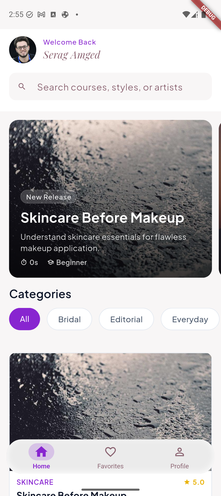 | 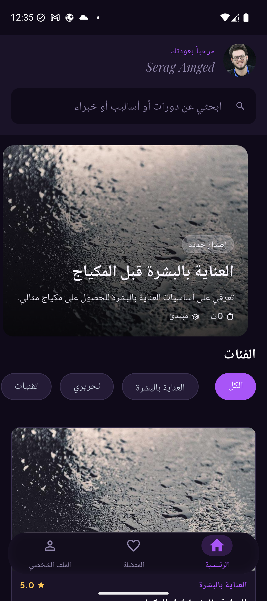 |
| 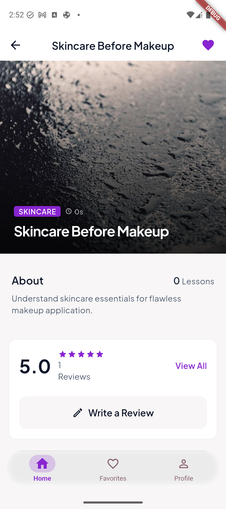 | 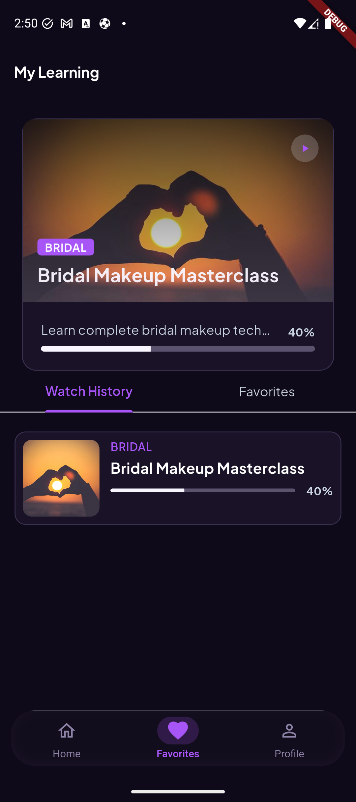 |

### User Journey

**Onboarding → Authentication**

| Onboarding | Sign In | Sign Up |
| --- | --- | --- |
|  | 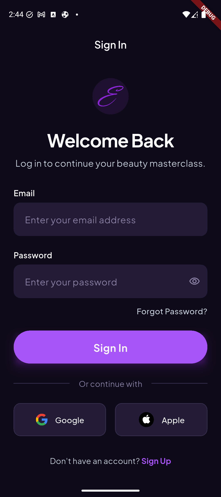 | 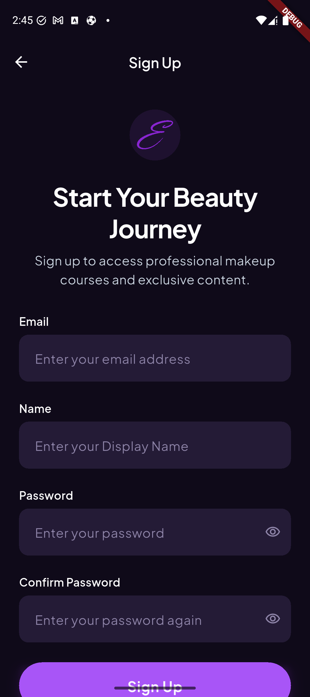 |

**Browsing → Course Detail → Reviews**

| Course Browsing | Course Details | Reviews |
| --- | --- | --- |
| 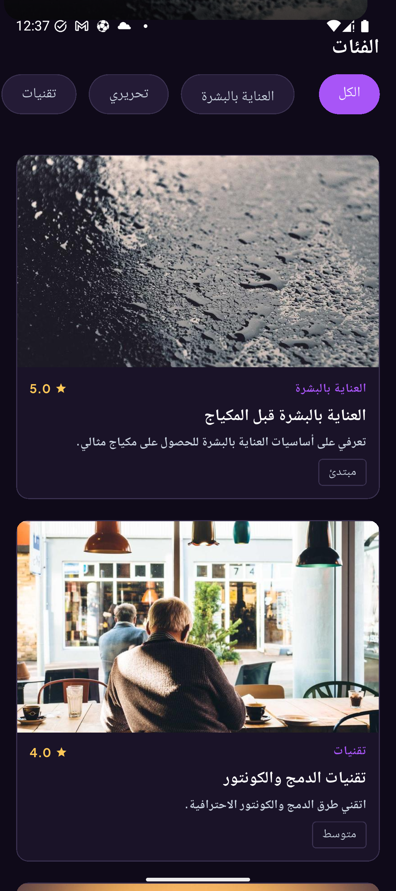 | 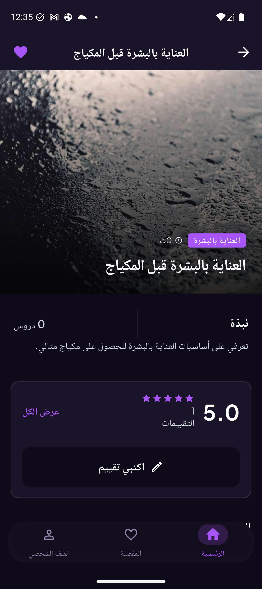 | 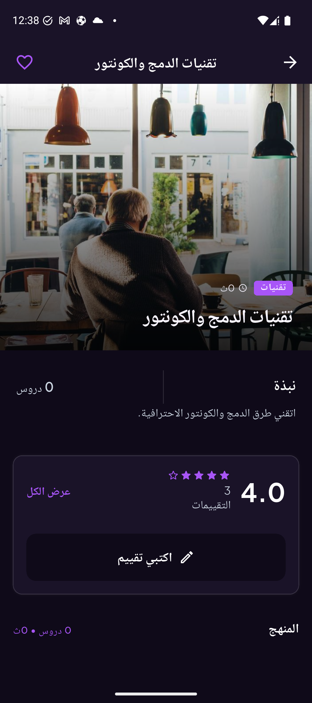 |

**My Learning (real progress data)**

"My Learning" tracks actual lesson progress end to end — this is a live screenshot of a course at 40% completion, with watch history pulled from the `get_watch_history` Supabase RPC described in [Progress & Analytics](#-progress--analytics).

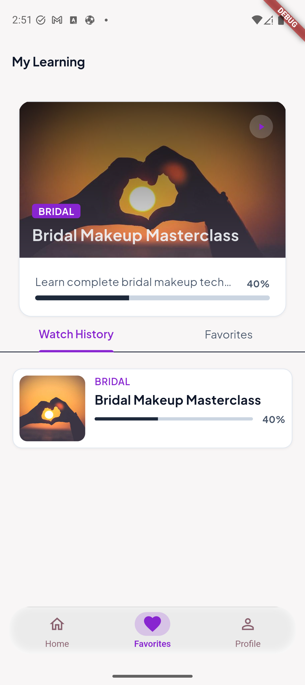

**Account & Subscription**

| Profile & Settings | Manage Subscription |
| --- | --- |
| 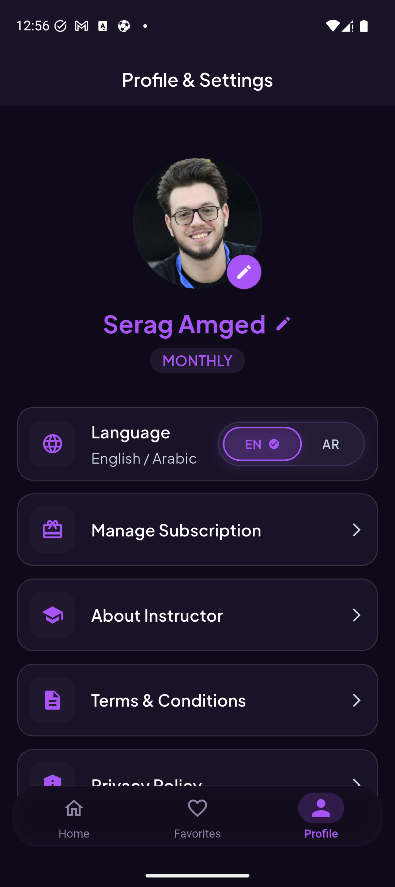 | 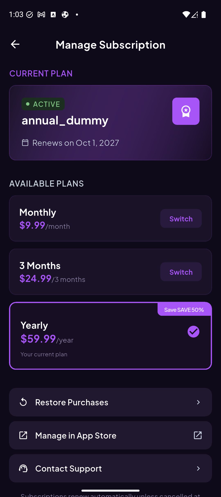 |

The Manage Subscription screen shows the real subscription UI, backed for now by a dummy RevenueCat data source (see [Payments & Subscriptions](#-payments--subscriptions)).

### Arabic (RTL)

Full right-to-left layout, not just mirrored text — navigation, cards, and forms all flip correctly.

| Home | Course Details | Profile |
| --- | --- | --- |
|  |  | 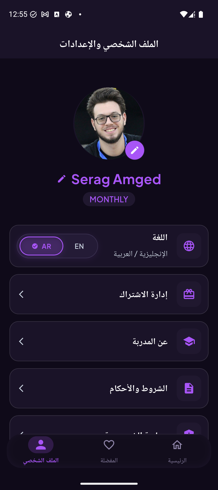 |

<details>
<summary>More screens (About Instructor, Terms, Forgot Password)</summary>

| About Instructor | Terms & Conditions | Forgot Password |
| --- | --- | --- |
| 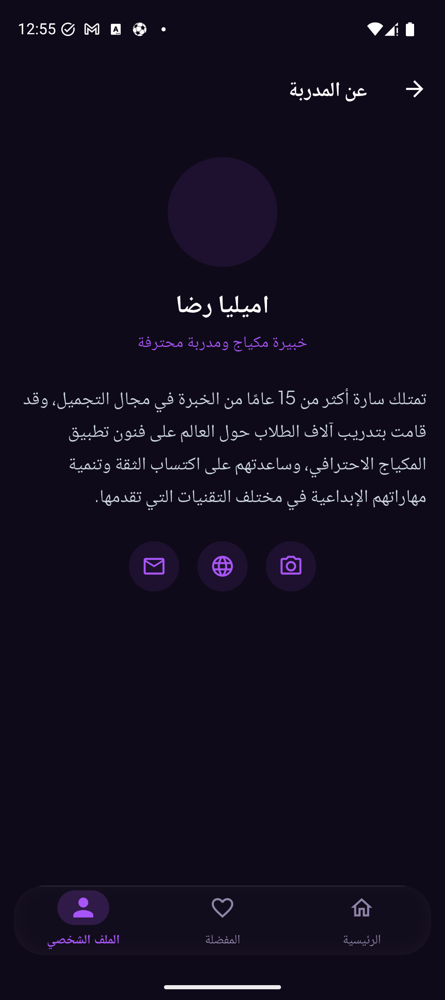 | 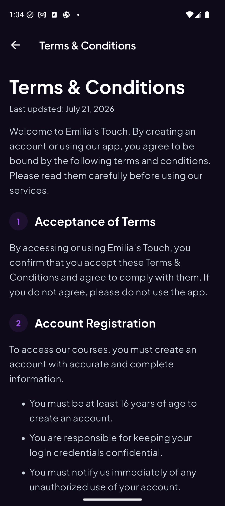 | 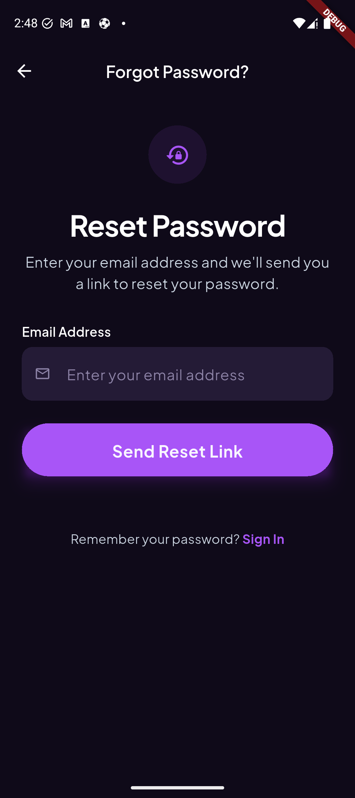 |

</details>

Not captured: the Lesson Player and the initial "Go Premium" paywall screen. The video player specifically needs a course whose lessons have a real Vimeo ID attached, which the account used for these screenshots didn't have set up for every course; the paywall is reached from a locked lesson via that same path. The `docs/screenshots/` folder is a normal image folder — add more there and reference them the same way to fill these in.

## 🎥 Course & Video System

- Course and lesson data is served from Supabase (Postgres tables + RPC functions such as `get_watch_history`, `get_favourite_courses`, `get_my_profile`).
- Lesson video is played through **Vimeo's hosted player**, embedded via `webview_flutter`: the lesson player loads a local HTML shell with a Vimeo iframe + the Vimeo Player.js SDK, and forwards `play`/`ended` events back into Flutter through a `JavaScriptChannel` to drive progress tracking.
- Locked lessons (no active subscription) render a blurred thumbnail + lock icon placeholder instead of the player.
- Video access is **not** currently protected beyond the app-level lock UI — there is no signed-URL or DRM layer; playback relies on Vimeo's own embed permissions.
- Supabase Storage is used in the current codebase only for **user avatar images**, not for video hosting.

## 💳 Payments & Subscriptions

The subscription UI (paywall, plan cards, manage-subscription screen) and the domain/repository layers are fully built out, targeting **RevenueCat** via the `purchases_flutter` SDK.

**Current state:** the repository is wired to `PaymentRemoteDataSourceDummy`, a hardcoded stand-in that returns fake offerings and customer info — **no live RevenueCat project is configured**, and no real purchases can be made in the current build. `REVENUECAT_APPLE_API_KEY` / `REVENUECAT_GOOGLE_API_KEY` exist as environment variables but are not consumed by the dummy path.

This was the direction in progress when the project was cancelled; connecting a real RevenueCat project (or swapping in a different payment processor) is the main remaining piece of work to make purchases functional.

## 🔐 Authentication & Backend

- **Backend:** Supabase (Postgres + Auth + Storage), accessed via `supabase_flutter`.
- **Auth methods:** email/password, Google Sign-In, Sign in with Apple, password reset via email link and OTP-based recovery.
- **Session/user handling:** `AuthRepository` maps Supabase auth events to a domain `AppUser`, joining against a `profiles` table for display name/avatar.
- **Deep links:** password recovery and OAuth callbacks use a custom `makeupapp://callback` scheme.
- **Database access:** feature repositories query Supabase tables directly and call Postgres RPC functions (`get_my_profile`, `get_favourite_courses`, `get_watch_history`, lesson-progress mutations) defined under `supabase/migrations/`.
- **Row-level security:** RLS is referenced by the RPC functions (`security definer`, `search_path` pinned) but policy definitions are not included in this repository's migration history, so RLS configuration should be treated as **needs verification** against the live Supabase project rather than assumed from the code here.

## 🌍 Localization

- Full English and Arabic translations — 273 matching keys across `lib/l10n/intl_en.arb` and `lib/l10n/intl_ar.arb`, generated into typed accessors (`S.of(context)`) via `flutter gen-l10n`.
- Arabic renders with Flutter's automatic RTL layout (driven by the active `Locale`) — see the [Arabic (RTL)](#-ui--screenshots) screenshots above for real examples across Home, Course Details, and Profile.
- User locale preference is synced to the Supabase profile (`update_my_profile` RPC) on sign-in and on explicit language toggle.

## 📊 Progress & Analytics

The app tracks **learning progress**, not general product analytics:

- Per-lesson status: `in_progress` / `completed`, timestamped, persisted via Supabase RPC calls triggered from the Vimeo player's `play` (started) and `ended` (completed) events.
- Course-level aggregation: `get_watch_history` returns, per course, watched-lesson count, total-lesson count, completion percentage, and last-watched timestamp, used to power the "My Learning" continue-watching list.
- There is no event-tracking/analytics system (no course-view counters, preview-view tracking, or subscription-event logging) implemented in this repository.

## 👤 User Application

Regular users can:

- Sign up / sign in (email, Google, Apple) and manage their password
- Browse courses by category, search, and view sponsored courses
- View course details, lessons, and reviews; submit a review
- Watch lessons (subject to subscription lock) and have progress tracked automatically
- View continue-watching / course progress under "My Learning"
- View/edit their profile, change language, and delete their account
- View the paywall and (once a live payment provider is connected) subscribe, and manage an existing subscription
- Read static Privacy Policy, Terms of Service, and About Instructor pages

## 🛠️ Admin Application

There is **no admin application or in-app admin dashboard** in this repository. A `role` field exists on the user profile (defaulting to `'user'`) and an `app_role` Postgres enum backs it, but no code in `lib/` reads or gates on that field — course/lesson/category content is managed directly in the Supabase backend rather than through an in-app admin UI.

## 📁 Project Structure

```
lib/
├── app/                  # App shell: router, DI setup, layout, top-level cubits
│   ├── di/
│   ├── presentation/
│   └── router/
├── core/                 # Cross-cutting: theme, constants, shared utils
│   ├── theme/
│   └── utils/
├── features/
│   ├── auth/             # Sign-in/up, password reset, social auth
│   ├── onboarding/
│   ├── courses/          # Courses, course details, reviews, lesson player, my learning
│   ├── payment/          # Subscription/paywall UI + RevenueCat-backed domain layer
│   ├── profile/          # Profile, settings, delete account
│   └── app_content/      # Static pages: instructor, privacy, terms
├── generated/             # freezed/json_serializable/DI/l10n generated code
├── l10n/                  # .arb source files + generated localization classes
└── main.dart
supabase/
└── migrations/            # RPC function definitions (profile, favorites, watch history)
docs/                       # Design specs, implementation plans, testing docs
```

## 🚀 Getting Started

### Prerequisites

- Flutter SDK compatible with Dart `^3.10.4` (run `flutter --version` to check; use `flutter upgrade` if needed)
- A Supabase project (URL + anon key)
- (Optional, for live purchases) A RevenueCat project with Apple/Google API keys

### Setup

```bash
# 1. Install dependencies
flutter pub get

# 2. Configure environment variables — create a .env file at the project root
```

Create a `.env` file (already referenced in `pubspec.yaml` assets, not committed to version control):

```env
SUPABASE_URL=your_supabase_url
SUPABASE_ANON_KEY=your_supabase_anon_key
WEB_CLIENT_ID=your_google_web_client_id
IOS_CLIENT_ID=your_google_ios_client_id
REVENUECAT_APPLE_API_KEY=your_revenuecat_apple_key
REVENUECAT_GOOGLE_API_KEY=your_revenuecat_google_key
```

```bash
# 3. Generate code (freezed models, injectable DI, json_serializable DTOs)
dart run build_runner build --delete-conflicting-outputs

# 4. Generate localization classes (if not already present)
flutter gen-l10n

# 5. Run the app
flutter run
```

**Never commit real values for the environment variables above.**

## ⚙️ Configuration

| Variable | Required | Purpose |
| --- | --- | --- |
| `SUPABASE_URL` | Yes | Supabase project URL |
| `SUPABASE_ANON_KEY` | Yes | Supabase anonymous/public API key |
| `WEB_CLIENT_ID` | Yes (for Google Sign-In) | Google OAuth web client ID |
| `IOS_CLIENT_ID` | Yes (for Google Sign-In on iOS) | Google OAuth iOS client ID |
| `REVENUECAT_APPLE_API_KEY` | Optional — unused while the dummy payment data source is active | RevenueCat iOS public API key |
| `REVENUECAT_GOOGLE_API_KEY` | Optional — unused while the dummy payment data source is active | RevenueCat Android public API key |

Supabase RPC functions the app depends on (see `supabase/migrations/`): `get_my_profile`, `get_favourite_courses`, `get_watch_history`, `update_my_profile`, plus lesson-progress mutation RPCs referenced from the lesson player. These must exist in the target Supabase project for the corresponding features to work.

## 🚧 Project Status

Development of this project was discontinued after the client cancelled the engagement during implementation. The repository therefore represents a partially completed version of the application. Core architectural and product foundations — authentication, course browsing, course details, lesson playback with progress tracking, profile management, and full EN/AR localization — were implemented and are functional against a real Supabase backend, while several planned features (live payments, production video delivery, admin tooling, broader test coverage) remained incomplete.

**Implemented**

- Clean Architecture across all features (presentation/domain/data)
- Supabase-backed authentication (email/password, Google, Apple) and password recovery
- Course browsing, search, categories, course details, reviews
- Lesson video playback (Vimeo embed) with play/completion progress tracking
- "My Learning" continue-watching and course progress view
- Profile management, avatar upload, language switching, account deletion
- Full English/Arabic localization with RTL
- Subscription/paywall UI and domain layer (RevenueCat-shaped, not live)
- Offline/connectivity handling and router-level guards

**Remaining / Planned**

- Live payment provider connection (real RevenueCat project, or an alternative processor)
- Production-grade, secured video delivery (current: unprotected Vimeo embed)
- Admin/content-management interface
- Push notifications
- Broader automated test coverage

## 🔮 Future Improvements

These are realistic next steps consistent with the existing architecture, not implemented functionality:

- Connect a live RevenueCat project (or migrate the existing payment domain layer to a different processor) to enable real purchases
- Introduce signed/expiring video URLs or a DRM-aware player if migrating away from a third-party hosted player
- Build a lightweight admin surface (or a Supabase-based internal tool) for managing courses/lessons/categories instead of direct table edits
- Expand automated test coverage: repository/cubit unit tests, and widget tests for the core user flows
- Add push notifications, backed by the existing notification toggle in Profile settings
- Add analytics/event tracking for course views, preview views, and subscription funnel events

## 📚 Technical Highlights

- **Consistent Clean Architecture** across every feature, with a shared `Result<T, DomainError>` pattern replacing exceptions at repository boundaries
- **Generated DI graph** (`get_it` + `injectable`) keeping constructors free of manual wiring
- **Dummy data source pattern** (`*RepositoryDummy` / `*DataSourceDummy`) used deliberately to let UI work proceed independent of backend/provider readiness (courses, payments)
- **Guard-based routing**: a single `go_router` `redirect` callback composes onboarding, auth, and connectivity state into one navigation decision, driven by a `Listenable` that bridges Cubit state changes into GoRouter refreshes
- **WebView-to-Flutter event bridging**: Vimeo Player.js events are relayed into the Flutter widget tree via a `JavaScriptChannel` to drive lesson progress without a native video SDK
- **Locale-aware UI mapping**: domain entities (e.g. course difficulty) are mapped to presentation UI models with localization applied at the mapper layer, keeping domain models locale-agnostic
- **Complete parity localization**: English and Arabic kept in lockstep (273/273 keys) with RTL handled natively by Flutter's localization system

## 👨‍💻 Author

**Serag Amged**

GitHub: [github.com/SeragAmged](https://github.com/SeragAmged) · Repository: [github.com/SeragAmged/makeup_app](https://github.com/SeragAmged/makeup_app)
